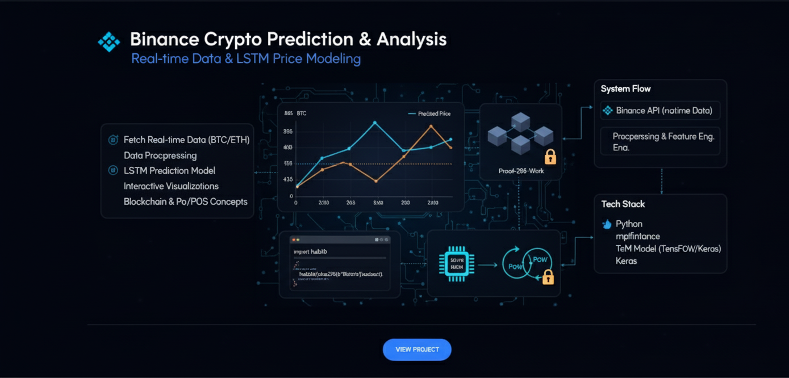

#  Binance Crypto Prediction & Analysis

This project connects to the **Binance API** to fetch real-time Bitcoin (BTC) and Ethereum (ETH) data, performs preprocessing and visualization, and builds a **price prediction model using LSTM neural networks**.

🔗 [Based on this tutorial](https://heartbeat.comet.ml/analyzing-and-creating-a-predictive-model-for-binance-data-69171dbd5bec)

---

 What is Bitcoin?


Bitcoin is a decentralized digital currency introduced in 2009. It uses a peer-to-peer network and **blockchain** to record secure, transparent, immutable transactions.

### Blockchain Structure

Each Bitcoin block stores transactions, timestamps, and the hash of the previous block — forming a secure chain.

```python
# Fetch block info
import requests
block_hash = "00000000..."
url = f"https://blockchain.info/rawblock/{block_hash}"
response = requests.get(url)
print(response.json())
```

### Proof-of-Work (PoW) – Mining Simulation

```python
def proof_of_work(prev_hash, tx, difficulty):
    ...
```

---

##  Security in Bitcoin

* **SHA-256 Hashing** ensures block immutability.
* **Digital Signatures** verify transaction authenticity.

```python
import hashlib
hashlib.sha256(b'Bitcoin').hexdigest()
```

---

##  What is Ethereum?


Ethereum is a decentralized platform for **DApps and smart contracts**, launched in 2015 by Vitalik Buterin. It runs on its own blockchain and powers its native token, **Ether (ETH)**.

### Example: Fetching Latest Ethereum Block

```python
from web3 import Web3
w3 = Web3(Web3.HTTPProvider("https://mainnet.infura.io/v3/YOUR_PROJECT_ID"))
print(w3.eth.blockNumber)
```

###  Smart Contract Example (Solidity)

```solidity
contract SimpleStorage {
    uint256 storedValue;
    function store(uint256 _val) public { storedValue = _val; }
    function retrieve() public view returns (uint256) { return storedValue; }
}
```

---

###  Ethereum Tech Highlights

* **EVM** – Executes smart contracts deterministically.
* **PoS** – Replaced PoW via "The Merge" in 2022.
* **Gas Fees** – Fuel for executing operations.

---

###  Use Cases

* **DeFi** – Lending, borrowing, trading.
* **NFTs** – Unique digital assets.
* **DAOs** – Decentralized governance.

---

##  Visualizing Results


---

## ⚙ Prerequisites

* Python 3.x, Anaconda, Jupyter Notebook
* Binance API Key
* Install Jupyter in VS Code (see [this setup video](https://www.youtube.com/watch?v=h1sAzPojKMg))

---

## 🛠 Installation


Create a `config.ini` file:

```ini
[binance]
api_key = your_api_key
api_secret = your_api_secret
```

---

##  Usage

Open `binance_prediction.ipynb` and run the notebook:

* Authenticate with Binance API
* Fetch BTC & ETH historical data
* Visualize with `mplfinance`
* Build & test an **LSTM** model
* Compare predicted vs. actual prices

---


##  Contributions

Feel free to open issues or pull requests!

---

##  Acknowledgments

* [Python-Binance](https://python-binance.readthedocs.io/)
* [TensorFlow](https://www.tensorflow.org/)
* [Keras](https://keras.io/)
* [mplfinance](https://github.com/matplotlib/mplfinance)
* [Pandas](https://pandas.pydata.org/)
* [NumPy](https://numpy.org/)

---

